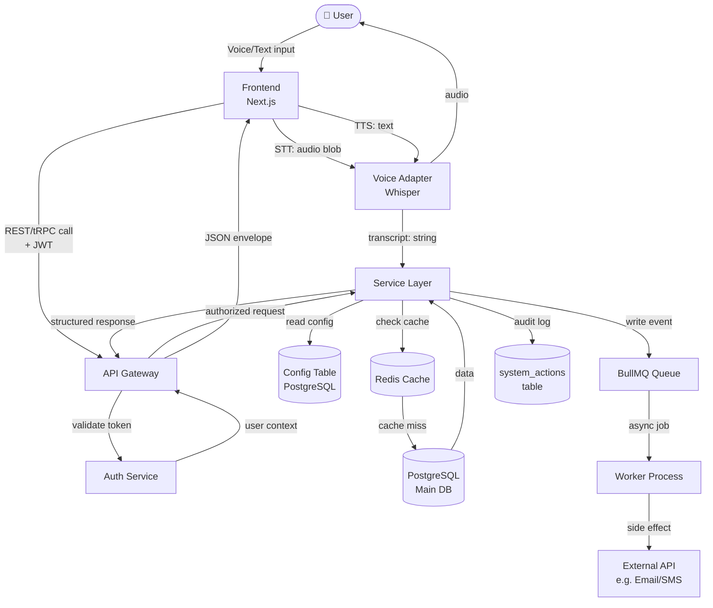

# Data Flow Diagrams & Wireframes

## When to Generate

Generate BOTH a data flow diagram AND wireframe at the START of every project, before
writing any code. Also regenerate when scope changes significantly.

The human should never have to imagine how data moves or what the screen looks like.
Show them first. Code second.

---

## Data Flow Diagram Protocol

Every data flow diagram must show:
1. All actors (user, browser, mobile app, server, DB, cache, queue, external services)
2. Every data movement (what data, which direction, which protocol)
3. Every transformation point (where data changes shape)
4. Every persistence point (where data is stored)
5. Every async boundary (where things happen out-of-band)

### Format: Use Mermaid flowchart (renders in GitHub, Notion, and Claude)



### Annotation Rules

Label every arrow with:
- **What** data is moving (not just "data")
- **Protocol** if not obvious (REST, gRPC, WebSocket, queue message)
- **Auth context** if the call is authenticated

Mark async flows with a dashed line `-.->` in Mermaid.
Mark external services with a different shape `([service])`.

---

## Wireframe Protocol

Generate wireframes as ASCII art + annotations for every screen. Then offer to generate
a visual HTML wireframe using the Visualizer tool.

### ASCII Wireframe Template

```
SCREEN: [Screen Name]
USER STORY: As a [user], I want to [action] so that [outcome]
TRIGGER: [what brings user here]

┌─────────────────────────────────────────────────┐
│ [COMPONENT NAME]      [COMPONENT]    [COMPONENT] │
│                                                  │
│  ┌──────────────────────────────────────────┐   │
│  │ [SECTION: Purpose of this block]         │   │
│  │                                          │   │
│  │  [Sub-component]    [Sub-component]      │   │
│  │                                          │   │
│  └──────────────────────────────────────────┘   │
│                                                  │
│  [COMPONENT]                      [CTA BUTTON]  │
└─────────────────────────────────────────────────┘

ANNOTATIONS:
→ [Component]: [why it's here, what data it shows, what happens on interaction]
→ [CTA]: [what it triggers, validation before enabling]
→ [Layout rule]: [which UX research rule governs this placement]
```

### Wireframe → HTML Visual

After showing ASCII, always offer:
> "Want me to render this as a clickable HTML wireframe? I can show the actual layout
> with correct spacing, component positions, and interaction states."

When generating the HTML wireframe, use the Visualizer tool. Apply:
- Correct 8pt grid spacing
- Research-backed component positions from `ux-ergonomics.md`
- Gray boxes for images/media
- Correct typography scale
- Interaction states shown (hover, active, disabled)

---

## Required Diagrams by Project Type

### Web App
1. **User journey flow** — happy path from landing to core value moment
2. **Data flow** — end-to-end from user input to DB and back
3. **Auth flow** — login, token refresh, logout, protected route
4. **Wireframes** — landing page, main dashboard, key feature screen

### Mobile App
1. **Navigation flow** — screen transitions, tab structure, deep links
2. **Data sync flow** — online vs offline, optimistic updates
3. **Auth flow** — onboarding + login + biometric
4. **Wireframes** — onboarding screens, main tab, key feature, empty states

### API / Microservices
1. **Service dependency graph** — which services call which
2. **Request lifecycle** — from API gateway through every service to DB and back
3. **Event flow** — async events produced and consumed by each service
4. **Deployment topology** — containers, load balancers, DBs, external services

### Data Pipeline
1. **Pipeline DAG** — stages, dependencies, failure paths
2. **Data lineage** — where data originates, how it transforms, where it lands
3. **Monitoring flow** — how failures are detected and alerted

---

## Data Flow Annotations to Always Include

For each data movement, document:

```
FROM:    [source component]
TO:      [destination component]
DATA:    [specific fields/payload, not just "data"]
WHEN:    [synchronous on request | async event | scheduled]
AUTH:    [public | requires JWT | service-to-service mTLS]
FAILURE: [what happens if this call fails]
RETRY:   [retried automatically | dead letter queue | user sees error]
```

---

## Live Wireframe Generation (Visualizer Integration)

When generating visual wireframes via the Visualizer tool:

1. Load `ux-ergonomics.md` first — apply research-backed placement
2. Use these wireframe conventions:
   - Background: `#F8F9FA`
   - Containers: white `#FFFFFF` with 1px `#E2E8F0` border, 8px radius
   - Placeholder image: `#CBD5E1` fill, camera icon
   - Text placeholder: varying width gray bars (`#94A3B8`)
   - CTA button: filled `#2563EB`, white text
   - Secondary button: outlined
   - Nav/header: `#1E293B` background
   - Active nav item: `#3B82F6` or left border indicator

3. Show multiple states where relevant:
   - Empty state (no data)
   - Loading state (skeletons)
   - Populated state (with realistic fake data)
   - Error state

4. Label every section with its component name and data source:
   ```
   [User Profile Card]
   data: GET /users/me
   updates: on login, on profile edit
   ```
