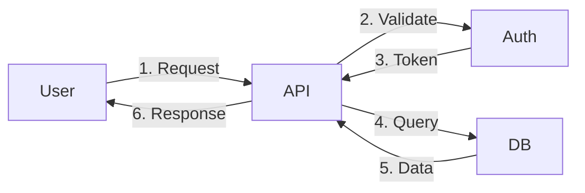

# Mockup-First & Image Reading Protocol

## Rule: ALWAYS Visual Before Code

```
❌ WRONG: User asks for feature → Write code
✅ RIGHT: User asks for feature → Show mockup → Confirm → Write code
```

**Why:** Misaligned code wastes hours. Misaligned mockup wastes minutes.

---

## Mockup Hierarchy

Use the right level for the task:

| Complexity | Mockup Type | Tool |
|------------|-------------|------|
| Simple component | ASCII | Text |
| Data flow | Mermaid diagram | Code block |
| Full screen | Wireframe | SVG/HTML artifact |
| Multi-screen | Flow + wireframes | Multiple artifacts |
| Design match | High-fidelity | React/HTML artifact |

---

## 1. ASCII Mockups (Simple)

For quick component visualization:

```
┌─────────────────────────────────────────┐
│  Header                        [User ▼] │
├─────────────────────────────────────────┤
│ ┌─────┐ ┌─────┐ ┌─────┐               │
│ │Card │ │Card │ │Card │               │
│ │ $99 │ │$149 │ │$299 │               │
│ │[Buy]│ │[Buy]│ │[Buy]│               │
│ └─────┘ └─────┘ └─────┘               │
├─────────────────────────────────────────┤
│  Footer                                 │
└─────────────────────────────────────────┘
```

Use for: Quick layouts, component structure, form fields

---

## 2. Mermaid Diagrams (Data/Flow)



Use for: API flows, user journeys, state machines, architecture

---

## 3. SVG/HTML Wireframes (Screens)

Generate interactive wireframe artifacts:

```html
<!-- Render as artifact -->
<div style="font-family: system-ui; padding: 20px; background: #f5f5f5;">
  <div style="background: white; border-radius: 8px; padding: 16px; box-shadow: 0 1px 3px rgba(0,0,0,0.1);">
    <h2 style="margin: 0 0 16px;">Dashboard</h2>
    <div style="display: grid; grid-template-columns: repeat(3, 1fr); gap: 16px;">
      <div style="background: #f0f9ff; padding: 16px; border-radius: 8px;">
        <div style="color: #666; font-size: 14px;">Revenue</div>
        <div style="font-size: 24px; font-weight: bold;">$12,345</div>
      </div>
      <!-- More cards -->
    </div>
  </div>
</div>
```

Use for: Full screens, complex layouts, before high-fidelity

---

## 4. High-Fidelity Mockups (Design Match)

When matching a specific design or uploaded image:

```tsx
// Generate React artifact that closely matches design
export default function Dashboard() {
  return (
    <div className="min-h-screen bg-gray-50">
      {/* Match exact colors, spacing, typography from design */}
    </div>
  );
}
```

Use for: When user uploads design, when pixel-perfect matters

---

## Mockup Workflow

```
1. USER: "Build a pricing page"
   
2. CLAUDE: Shows ASCII mockup
   ┌────────────────────────────────────┐
   │  Pricing                           │
   ├────────────────────────────────────┤
   │ [Free]    [Pro]     [Enterprise]   │
   │  $0/mo    $29/mo    Custom         │
   │  • 3 proj • Unlim   • Everything   │
   │  • Basic  • Priority• Dedicated    │
   │  [Start]  [Start]   [Contact]      │
   └────────────────────────────────────┘
   
   Does this layout match what you want?

3. USER: "Yes but horizontal cards, not vertical"

4. CLAUDE: Updates mockup
   ┌──────────────────────────────────────────┐
   │ ┌──────────┐ ┌──────────┐ ┌──────────┐  │
   │ │ Free     │ │ Pro ★    │ │Enterprise│  │
   │ │ $0/mo    │ │ $29/mo   │ │ Custom   │  │
   │ │ Features │ │ Features │ │ Features │  │
   │ │ [Start]  │ │ [Start]  │ │ [Contact]│  │
   │ └──────────┘ └──────────┘ └──────────┘  │
   └──────────────────────────────────────────┘
   
   Better?

5. USER: "Yes"

6. CLAUDE: Now writes code matching approved mockup
```

---

## Reading Uploaded Images/PNGs

### When User Uploads Design Image

```
1. ANALYZE the image:
   - Layout structure (grid, flex, columns)
   - Color palette (extract hex codes)
   - Typography (identify fonts, sizes)
   - Spacing (estimate padding, margins)
   - Components (buttons, cards, inputs)
   - Interactions (hover states if shown)

2. DESCRIBE what I see:
   "I see a dashboard with:
   - Header: Logo left, nav center, user menu right
   - Sidebar: 240px, dark theme, icon+label nav
   - Main: 3-column card grid, white cards on gray
   - Colors: Primary #3B82F6, Background #F3F4F6
   - Font: Appears to be Inter or similar sans-serif"

3. CONFIRM understanding:
   "Is this accurate? Any details I missed?"

4. GENERATE matching code:
   - Match colors exactly (extracted hex)
   - Match spacing proportionally
   - Match component styles
   - Match typography
```

### Image Analysis Checklist

When reading a design PNG:

```
□ Layout
  - Grid structure?
  - Responsive breakpoints visible?
  - Sidebar/header/footer pattern?

□ Colors
  - Primary color (hex)?
  - Secondary color?
  - Background colors?
  - Text colors?
  - Accent/status colors?

□ Typography
  - Font family (or closest match)?
  - Heading sizes?
  - Body text size?
  - Font weights used?

□ Components
  - Button styles (rounded, square, pill)?
  - Card styles (shadow, border, rounded)?
  - Input styles?
  - Icon style (outline, filled)?

□ Spacing
  - Base unit (4px, 8px)?
  - Section padding?
  - Component gaps?

□ Effects
  - Shadows?
  - Borders?
  - Gradients?
  - Blur/glass effects?
```

### Example Image Reading

```
USER: [Uploads dashboard.png]

CLAUDE:
## Design Analysis

**Layout:**
- Full-width header (h-16)
- Left sidebar (w-64, collapsible)
- Main content with 24px padding
- 3-column metric cards grid

**Colors Extracted:**
- Primary: #6366F1 (indigo)
- Background: #F9FAFB (gray-50)
- Card background: #FFFFFF
- Text primary: #111827 (gray-900)
- Text secondary: #6B7280 (gray-500)
- Success: #10B981
- Warning: #F59E0B

**Typography:**
- Font: Inter (or system sans)
- Headings: 600 weight
- Body: 400 weight
- Sizes: 24px (h1), 18px (h2), 14px (body), 12px (small)

**Components:**
- Cards: rounded-xl, shadow-sm, p-6
- Buttons: rounded-lg, h-10
- Sidebar nav: icon + label, hover:bg-gray-100

**Ready to generate matching code. Confirm?**
```

---

## Mockup Response Template

Every UI task follows this:

```
## Understanding
[What you want in one sentence]

## Mockup
[ASCII / Mermaid / Artifact]

## Confirm
Does this match your vision? 
- Layout correct?
- Components right?
- Flow makes sense?

[Wait for confirmation or adjustment]

## Code
[Only after mockup approved]
```

---

## When to Skip Mockup

Only skip if:
- User says "just code it"
- Fixing existing code (not new UI)
- API/backend only (no UI)
- User uploaded detailed design to match exactly

Otherwise: **Always mockup first.**
